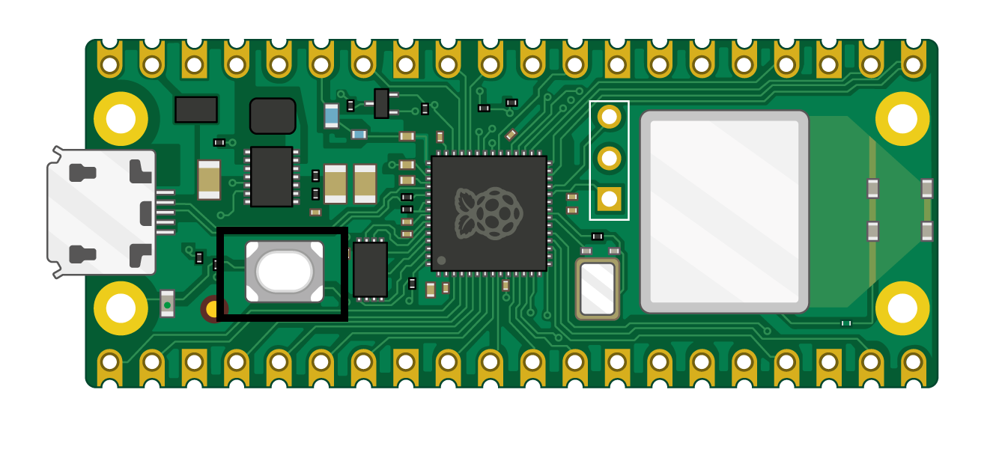

# My Raspberry Pi Pico W Practices

This repository contains my personal practices and projects for learning how to use the Raspberry Pi Pico W.

## About the Raspberry Pi Pico

The Raspberry Pi Pico is a microcontroller board based on the RP2040 microcontroller chip. It is designed for physical computing projects and is capable of interfacing with a wide range of sensors, displays, and other hardware.

## Practices and Projects

This repository contains a collection of practices and projects that I have created while learning how to use the Raspberry Pi Pico. Each practice or project is contained in its own directory and includes a `README.md` file with instructions on how to build and run the code.

## Getting Started

To get started with these practices and projects, you will need a Raspberry Pi Pico and a micro-USB cable to connect it to your computer. You will also need to install the [Raspberry Pi Pico C/C++ SDK](https://datasheets.raspberrypi.org/pico/getting-started-with-pico.pdf) and set up your development environment.

Once you have set up your development environment, you can clone this repository to your local machine and navigate to one of the practice or project directories. Follow the instructions in the `README.md` file to build and run the code.

## Contributing

I welcome contributions to this repository! If you have created a practice or project that you would like to share, feel free to open a pull request.
